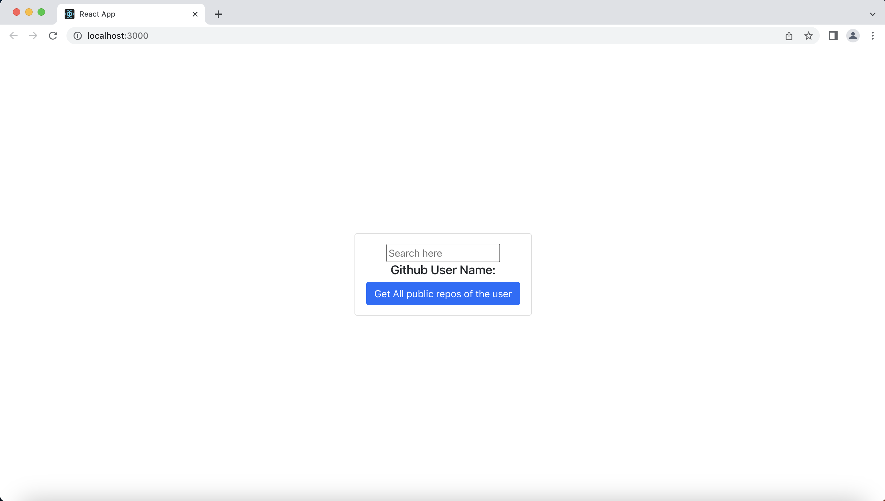
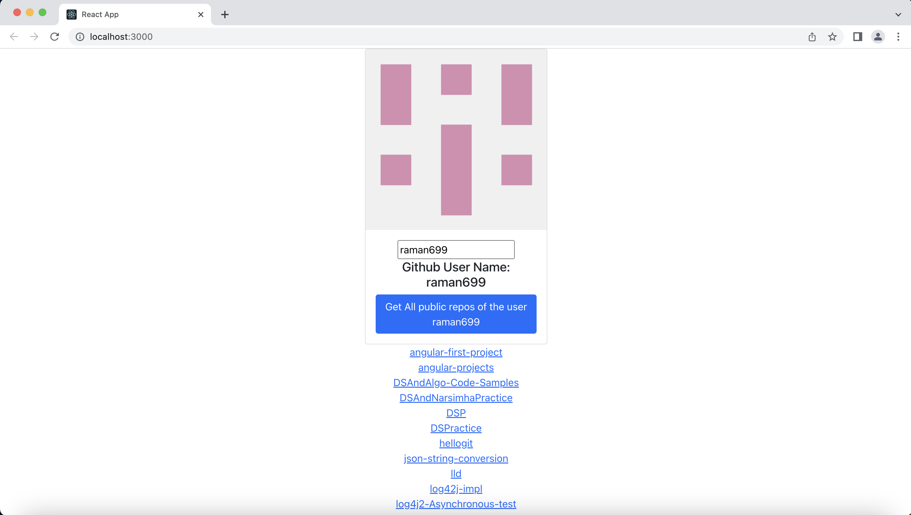

# The React project list down all the public repos of the github userName entered by the user.

Steps to run the project
1. Clone project in your local directory and navigate to the local folder
2. Run `npm install` in the terminal
3. Run `npm start` in the terminal
4. Go to http://localhost:3000/
5. Enter the github user name and click on the button as shown in below pic
Samples images: 

